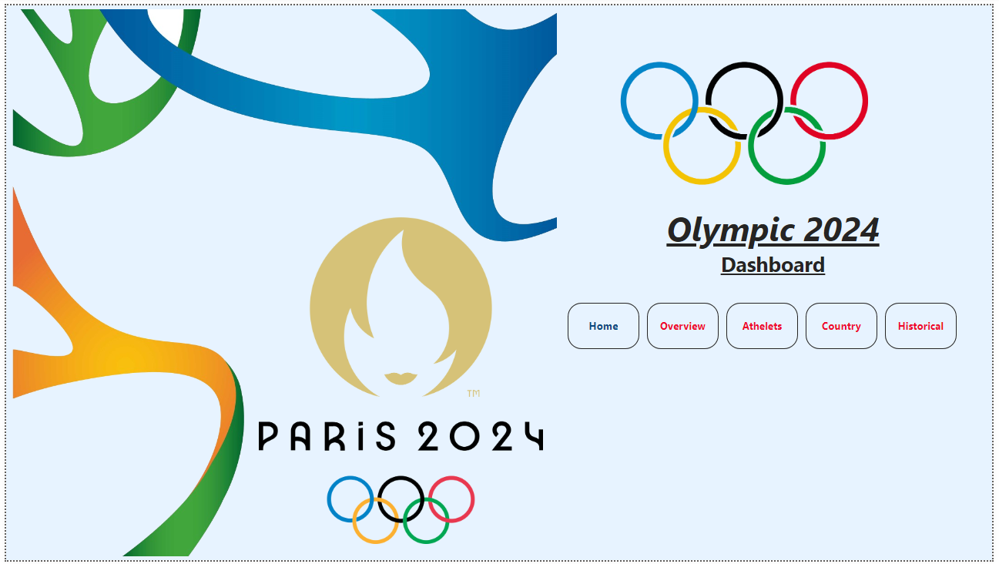
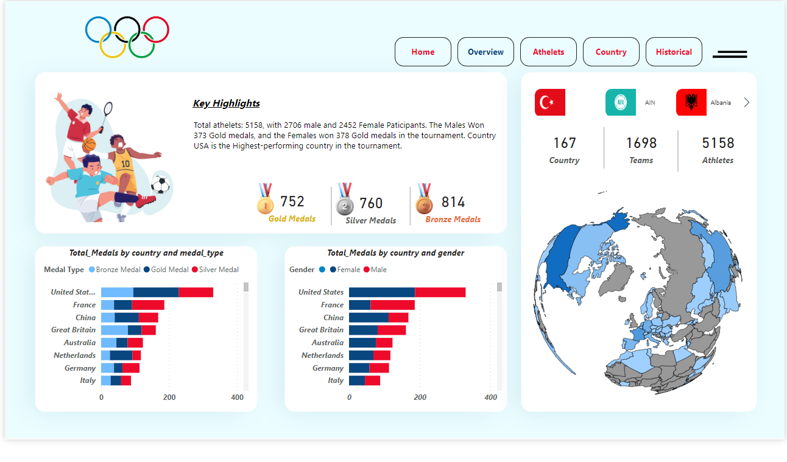
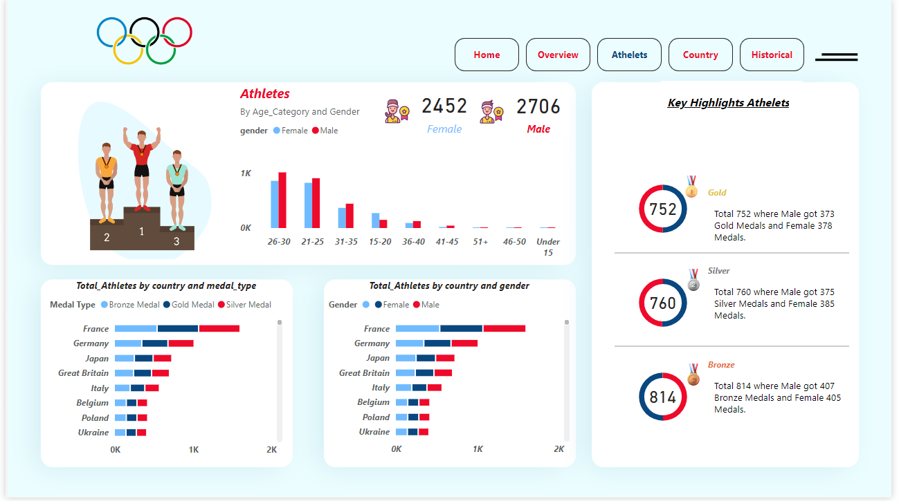
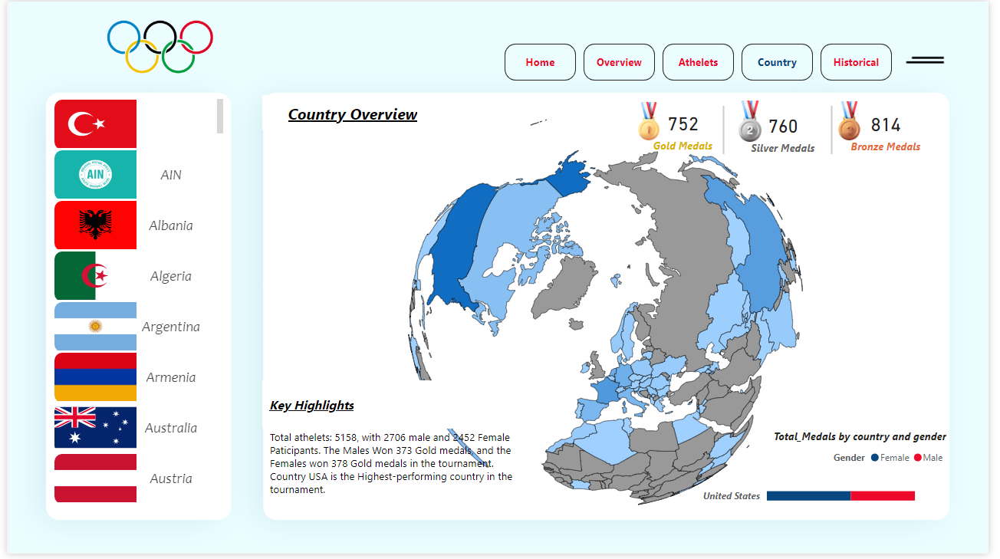
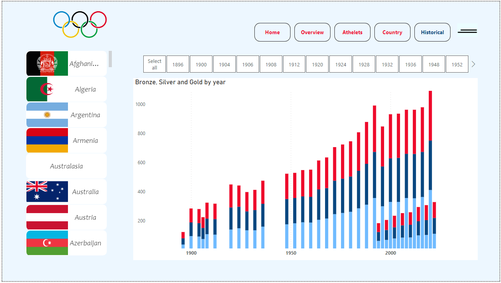

# Paris 2024 Olympic Dashboards

Welcome to the Paris 2024 Olympic Dashboards project. This repository contains interactive dashboards created for the Paris 2024 Olympics. The dashboards are designed to provide comprehensive insights into various aspects of the Olympics, including medals, athlete performance, country highlights, and historical data.

## Dashboard Pages

### 1. Index Page
The Index Page serves as the main navigation hub for the dashboards. It allows users to easily navigate to other pages and provides a central point of access to all the features of the Olympic Dashboards.



### 2. Overview Page
The Overview Page provides a country-wise breakdown of medals, gender distribution, and key highlights. Users can quickly assess the performance of different countries and gain insights into overall Olympic trends.



### 3. Athletes Page
The Athletes Page allows users to view detailed performance metrics of athletes, including their gender, country, and medal counts. This page offers a deep dive into individual athlete performances.



### 4. Country Page
The Country Page focuses on country-wise highlights, showcasing key information and performance metrics specific to each country participating in the Olympics.



### 5. Historical Data Page
The Historical Data Page provides users with the flexibility to analyze historical data by year and country. Users can change charts and view data trends over different periods.



## Installation

1. Clone the repository:
    ```bash
    git clone https://github.com/Hemant190894/main.git
    ```

2. Navigate to the project directory:
    ```bash
    cd main
    ```

3. Open the `Olympic_Dashboard.pbix` file in Power BI Desktop to explore the dashboards.

## Contributing

If you'd like to contribute to this project, please fork the repository and submit a pull request. We welcome suggestions and improvements!

## Contact

For any questions or feedback, please contact [Hemant Dayma](hemant.dayma19@gmail.com) 
<div align="left">
  <a href="https://www.linkedin.com/in/hemant-dayma/" target="_blank" style="display: inline-block; margin-right: 10px;">
    
  </a>.

---

Feel free to add more sections or details as needed. Happy exploring!
